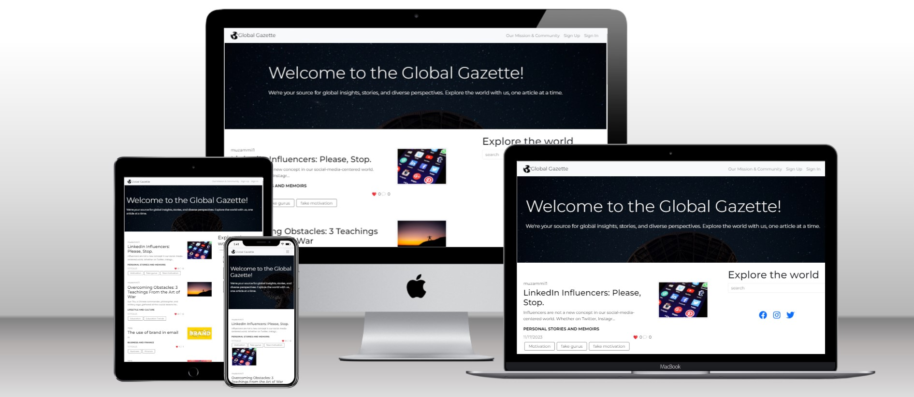
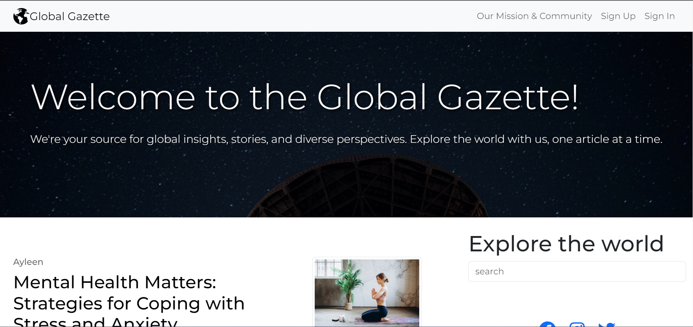
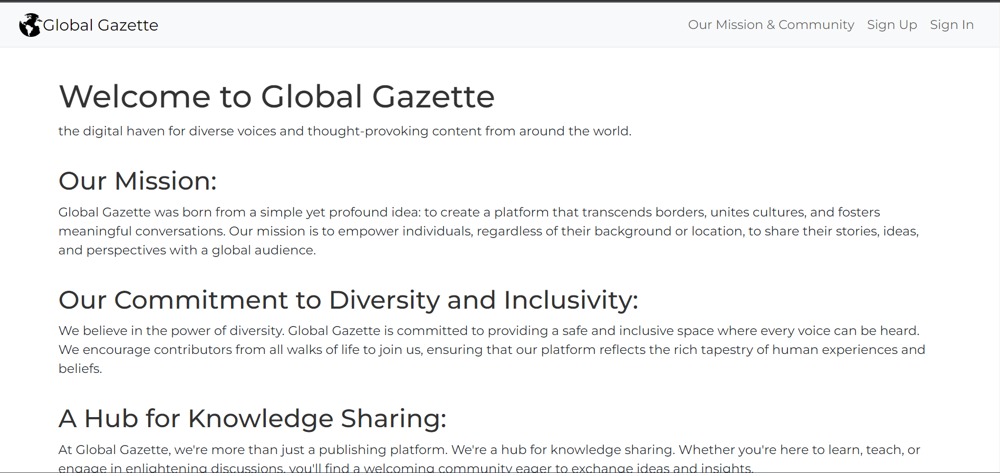
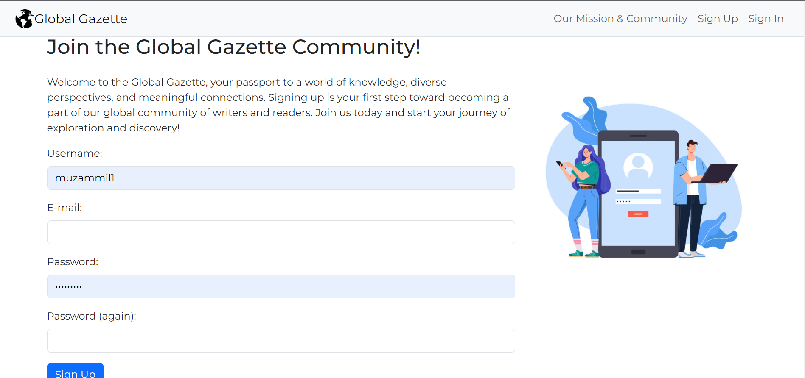
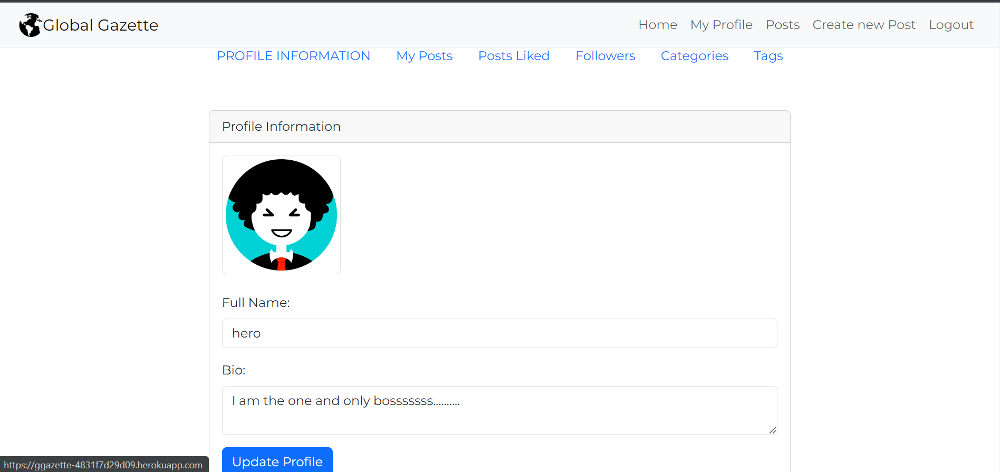
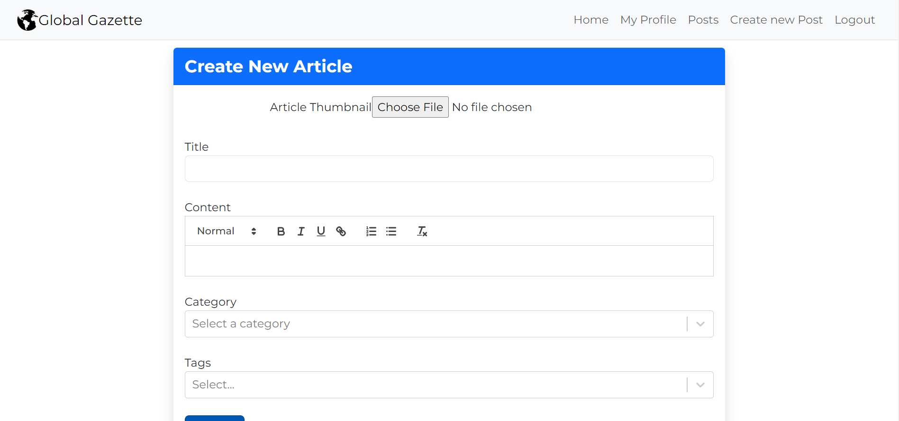
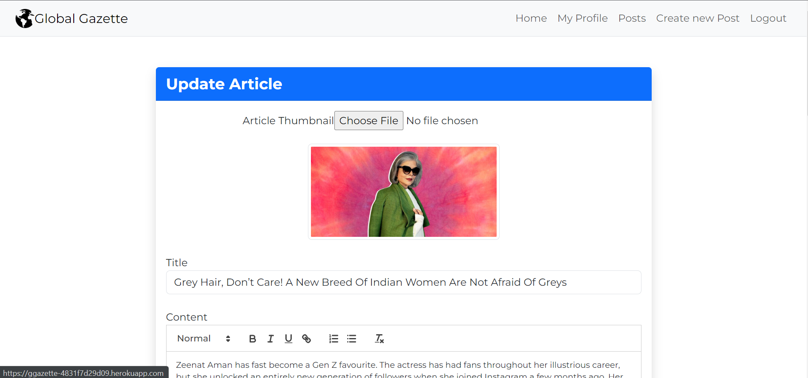
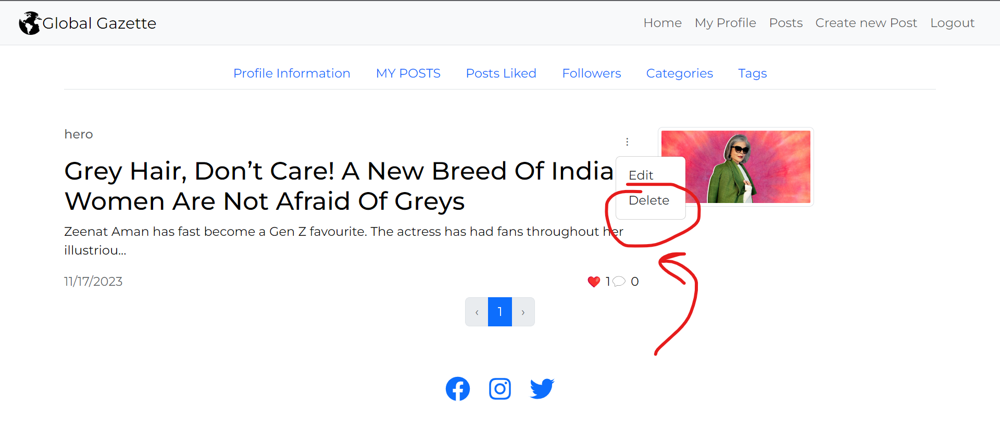
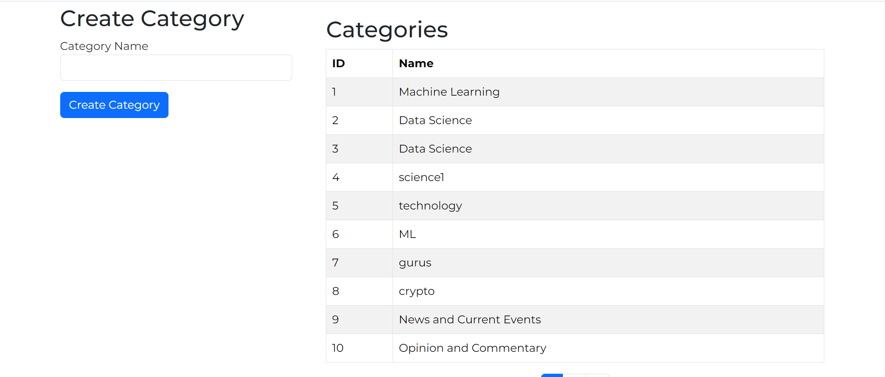
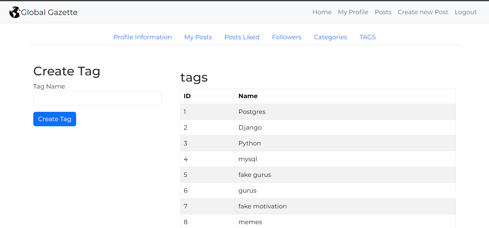

Perspective
-----------

Welcome to the Global Gazette – your digital expanse for global discourse and diversity. We believe that the essence of community is rooted in the sharing of ideas, stories, and a multitude of perspectives. Our platform is more than just a place to read and write; it's a space where individuals from all corners of the globe can converge to inspire and be inspired, to learn, and to grow together.

The Global Gazette is committed to fostering a community where open and constructive conversations thrive. As a hub for content creators and consumers alike, we empower you to voice your thoughts, share your narratives, and connect with a like-minded audience on a global scale.

Our mission extends beyond mere communication; it is about building a foundation for stronger, more resilient global ties. It is about nurturing a place where memories are shared, where knowledge is exchanged, and where every voice can make an impact. Join us in our quest to keep the essence of community alive and vibrant, one story at a time.

Explore our platform, share your moments, and rediscover the world through the eyes of its citizens. This is Global Gazette – Where every story matters, and every voice counts.

 ## Deployed Link

- [Front-End Deployed Link](https://ggazette-4831f7d29d09.herokuapp.com/)

## Back End Links
- [Back End Deployed Link](https://gg-backend-78d63a43777b.herokuapp.com/api/articles/)
- [Back End GitHub](https://gg-backend-78d63a43777b.herokuapp.com)

User Experience (UX)
--------------------

### Site Goals

The Global Gazette is dedicated to creating an engaging, informative, and inclusive platform for sharing and discussing global narratives. Our goals are to:

*   Encourage the sharing of diverse perspectives to foster global conversations.
*   Empower users to create and share content that resonates with them and others.
*   Connect people from around the world in meaningful discussions.
*   Offer a seamless and intuitive user experience for content discovery and interaction.
*   Promote knowledge sharing through tutorials, guides, and informative articles.

### Scope

With a clear vision for the Global Gazette, the scope of our UX design includes:

*   A responsive design that adapts to any device, enhancing accessibility for all users.
*   Intuitive navigation that guides users through the site with ease.
*   Efficient search and filtering options to quickly find relevant content.
*   User profiles that showcase individual contributions and foster community connections.

### Epics & User Stories

Our development is driven by epics and user stories that focus on delivering value to our users. They are outlined as follows:

#### Epic 1: User Authentication

*   As a user, I can sign up for an account so that I can personalize my experience and contribute to the site.
*   As a user, I can log in and log out securely to protect my personal information.

#### Epic 2: Content Creation and Interaction

*   As a contributor, I can create and edit my posts so that I can share my stories and knowledge.
*   As a reader, I can like and comment on posts that I find engaging.

#### Epic 3: Content Discovery and Exploration

*   As a user, I can filter content by categories so that I can easily find topics of interest.
*   As a user, I can search for specific content using keywords to quickly access desired information.

#### Epic 4: Profile Management

*   As a user, I can follow other contributors to keep up with their latest posts.
*   As a user, I can edit my profile to maintain my personal brand on the platform.

### Epics & User Stories
#### Epic 1: User Authentication and Navigation
This epic focuses on user authentication, ensuring that users can sign up, sign in, and maintain their logged-in status. It also addresses navigation by providing a consistent navbar across all pages and enabling quick page transitions through routing. Users can easily access authentication options and navigate throughout the platform seamlessly.
##### Related User Stories
- As a user, I can view a navbar from every page so that I can easily navigate between pages.
- As a user, I can navigate through pages quickly using routing so that I can view content seamlessly without page refresh.
- As a user, I can sign up for a new account so that I can access all the features for signed-up users.
- As a user, I can sign in to the app so that I can access functionality for logged-in users.
- As a user, I can check my logged-in status so that I can log in if needed.
- As a user, I can maintain my logged-in status with token refreshes so that my user experience is not compromised.
- As a logged-out user, I can see sign-in and sign-up options in the navigation bar for easy access.
#### Epic 2: Content Creation and Interaction
This epic is centered around content creation and user interaction with posts. Users, especially logged-in users, can create and share posts with images. They can also view the details of posts and express their support by liking them. It enhances the platform's core functionality of content sharing and engagement.
##### Related User Stories
- As a logged-in user, I can create posts with images to share my content with the world.
- As a user, I can view the details of a single post to learn more about it.
- As a logged-in user, I can like a post to show my support for content that interests me.
#### Epic 3: Content Discovery and Exploration
This epic is about helping users discover and explore content on the platform. Users can view the most recent posts, search for specific content using keywords, access their liked posts, and follow users to see their content. Infinite scroll ensures a smooth and continuous content browsing experience.
##### Related User Stories
- As a user, I can view the most recent posts, ordered by the most recently created first, to stay up-to-date with the newest content.
- As a user, I can search for posts using keywords to find specific content and user profiles.
- As a logged-in user, I can view posts I've liked for quick access to content I enjoy.
- As a logged-in user, I can view posts from followed users to keep up with their posts.
- As a user, I can scroll through content with infinite scroll, which loads more content automatically.
#### Epic 4: Post Interaction and Commenting
This epic focuses on interactions related to posts and comments. Users can view comments on posts, edit their own posts, and add comments to share their thoughts. It also includes features such as comment date display, comment deletion, and comment editing, enhancing the overall post interaction experience.
##### Related User Stories
- As a user, I can view the comments on a post to read what other users think about it.
- As a post owner, I can edit my post's title and description to make corrections or updates.
- As a logged-in user, I can add comments to a post to share my thoughts.
- As a user, I can see how long ago a comment was made to understand its recency.
- As a comment owner, I can delete my comment to control its removal.
- As a comment owner, I can edit my comment to make changes or updates.
#### Epic 5: User Profiles and Interaction
This epic revolves around user profiles and interactions between users. Users can view other users' profiles, discover popular profiles, see user statistics, follow/unfollow users to customize their content feed, view all posts by a specific user, and edit their own profiles. It ensures a rich user-to-user interaction experience on the platform.
##### Related User Stories
- As a user, I can view other users' profiles to see their posts and learn more about them.
- As a user, I can see a list of the most followed profiles to discover popular users.
- As a user, I can view user statistics, including bio, number of posts, follows, and followers.
- As a logged-in user, I can follow and unfollow other users to customize my posts feed.
- As a user, I can view all posts by a specific user to catch up on their latest content or decide to follow them.
- As a logged-in user, I can edit my profile, including changing my profile picture and bio.
- As a logged-in user, I can update my username and password for security and display name changes.
## Design - UI
The Global Gazette's overall design philosophy revolves around a clean, intuitive, and user-friendly interface. Readability and ease of navigation are prioritized to ensure that our readers can effortlessly access a world of global insights and stories. The design is aimed at creating a seamless and enjoyable browsing experience.
### Typography
Montserrat has been caefully selected as the primary font. Its modern and bold design complements the theme of the Global Gazette, while ensureing readability and an elegant, timeless feel.
### Color Palette
The color palette is based on a clean and sophisticated black-and-white scheme. Black font color exudes elegance and reliability, while the white background serves as a canvas, allowing our content to take center stage. This minimalist approach ensures that our platform remains visually appealing and user-focused.
#### Background (White)
A clean white background serves as a canvas, spotlighting our content and enhancing the overall readability of the site.
#### Font Color (Black)
The black font color exudes elegance and timelessness, emphasizing the reliability.
### Logo & Imagery
The logo, elegantly designed with Montserrat typography, features a globe at its core. This globe symbolizes the platform's global identity and its mission to connect minds, cultures, and perspectives from every corner of the world.
### Layout & Composition
The layouts are structured for a seamless reading experience with an intuitive infinite scroll. This feature allows readers to effortlessly explore a continuous flow of engaging articles and stories. Generous whitespace ensures a clutter-free interface, emphasizing content purity and simplicity, and enhancing overall readability.

Tasks
=====

This section outlines the tasks and steps undertaken during the development of the frontend project, focusing on key phases and future enhancements.

Before Project Inception
------------------------

*   Design Entity Relationship Diagram.
*   Set up and create Back End API using Django Rest API framework.
*   Create Project, Epics, User Stories and prepare Kanban Board.
*   Creation of Project in Codeanywhere.

Project Setup
-------------

*   Set up ReactJS project using Vite.
*   Install dependencies as listed in package.json.

Coding and Development
----------------------

Developing the application's components, pages, and features following React best practices.

Testing
-------

Conducting thorough testing across different components and ensuring code quality with ESLint.

Repository Management
---------------------

Create Frontend Repository in GitHub and manage version control.

Future Tasks
------------

Outline of features and enhancements planned for future development iterations.

*   Integration of react-notify-toast for user notifications.
*   Addition of emoji-picker in the comment section.
*   Implementation of category badge display and active badge functionality.
*   Feature to allow users to add media files in addition to images.

Design
======

This section covers the design aspects of the frontend project, including color schemes, typography, imagery, and wireframes.

Colors
------

The color scheme for the project is chosen with accessibility and aesthetic appeal in mind, suitable for all age groups.

*   Brief description of the color palette.
*   Explanation of the color choice rationale.
*   Link or reference to the color palette source, if any.

Typography
----------

Details about the font choices for the project, their sources, and the rationale behind their selection.

*   Primary and secondary fonts used in the project.
*   Usage of Google Fonts or any other font libraries.
*   Considerations for readability and user experience.

Imagery
-------

Overview of the types of imagery used in the project, their sources, and the guidelines for their selection.

*   Types of images used (e.g., icons, photographs).
*   Sources of the images, such as stock photography sites.
*   Guidelines or themes followed in selecting the imagery.

Wireframes
----------

Information about the wireframes created for the project, including the tools used and links to the wireframes.

*   Balsamiq
*   [Desktop]("./documentation/wireframe.pdf") [Mobile]("./documentation/wireframe.pdf") [Tablet]("./documentation/wireframe.pdf").

Project Documentation
=====================

1\. Home Page
-------------

Description: The Home page is the landing page of the application. It provides an overview of what the application is about and may include a navigation bar, introductory content, and links to other sections.

2\. Community Page (Our Mission)
--------------------------------

Description: This page outlines the mission and values of the community. It's a crucial part of the application to convey the purpose and ethos of the platform to the users.

3\. Registration Page
---------------------

Description: The Registration page allows new users to create an account. It typically includes a form for entering user details like username, email, and password.

4\. Login Page
--------------

Description: The Login page enables existing users to access their accounts by entering their credentials.

5\. User Profile
----------------

Description: The User Profile page displays user-specific information like their posts, followers, and personal details. It serves as a hub for each user's activity and settings.

6\. Article Creation and Management
-----------------------------------

Description: These features enable users to create, view, update, and delete articles. They form the core functionality of the application where users can interact with content.

   

7\. Additional Features
-----------------------

Description: Additional features like category management, tagging, and community interactions are integral to the application, providing users with a richer experience.

  

Components
=======================

Core Components
---------------

### App.jsx

The main component that wraps the entire application. It's the entry point for the app's UI and logic.

### Assets

Contains static assets like images used throughout the application.

UI Components
-------------

### AuthNavbar.jsx

A navigation bar component specifically for authenticated users, providing links to user-specific features and pages.

### Footer.jsx

The footer component for the application, usually containing copyright and other essential links.

### GNavbar.jsx

A general navigation bar used across various pages of the application for navigation.

### Login/Form.jsx

The form component used on the Login page for users to enter their credentials.

### NavBar.jsx

A versatile navigation bar component used throughout the application.

### OurMission.jsx

A component representing the 'Our Mission' section, often used to describe the purpose and goals of the application.

Profile Components
------------------

### Profile/Profile.jsx

The main profile component displaying user information, posts, and activities.

### Profile/AllLikedPosts.jsx

Displays all posts liked by the user.

### Profile/MyOwnedPosts.jsx

Shows posts created by the user.

### Profile/Navigation.jsx

Provides navigation specific to the user's profile, like links to followers, following, etc.

Article Components
------------------

### articles/Articles.jsx

The main component to display articles/posts in the application.

### articles/CreateArticle.jsx

Used for creating new articles or posts.

### articles/ArticleUpdate.jsx

Enables users to update their existing articles.

Home Components
---------------

### home/Hero.jsx

The hero section of the home page, typically showcasing major features or calls to action.

### home/MostFollowedUsers.jsx

Displays the most followed users, contributing to the community aspect of the application.

Registration Components
-----------------------

### register/Form.jsx

The registration form component for new users to sign up.

Context and Data Handling
-------------------------

### context/ReactQueryContext.jsx

Manages the React Query context for efficient data fetching and state management.

### data/config.js

Contains configuration settings and constants used throughout the application.

Layout Components
-----------------

### layouts/GuestLayout.jsx

A layout component used for pages accessible to non-authenticated users.

### layouts/Layout.jsx

The main layout component, defining the overall look and feel of the application.

Utility Functions
-----------------

### utils/api.jsx

Contains API-related utility functions for data fetching and processing.

### utils/timeAgo.jsx

Utility function to display time in a 'time ago' format.

Technology Stack
==============================

Overview
--------

This document outlines the technology stack used in the development of the application. It includes programming languages, libraries, frameworks, and tools that are integral to the project.

Languages
---------

*   **JavaScript (JSX):** A programming language used for writing components and logic in React.
*   **CSS:** Used for styling the components and pages within the application.
*   **HTML:** The markup language used to structure the web application.

Frameworks and Libraries
------------------------

*   **React:** A JavaScript library for building user interfaces, particularly single-page applications.
*   **React Router:** A standard library for routing in React, used for navigating between pages and components.
*   **React Query:** A library for fetching, caching, and updating asynchronous data in React.
*   **Bootstrap & React-Bootstrap:** Front-end framework used for designing responsive and mobile-first web pages.
*   **Vite:** A modern frontend build tool that significantly improves the frontend development experience.
*   **Font Awesome:** An icon library used to add icons to the web application.
*   **React Quill:** A library providing rich text editor component for React applications.
*   **ESLint:** A tool for identifying and reporting on patterns found in ECMAScript/JavaScript code, helps in maintaining code quality.

Tools
-----

*   **Git:** Version control system used for tracking changes in source code during software development.
*   **GitHub:** A platform for hosting and version control using Git, also provides access control and several collaboration features.
*   **Heroku:** A cloud platform as a service supporting several programming languages, used for deploying, managing, and scaling modern apps.

Other Technologies
------------------

*   **DOMPurify:** A DOM-only, super-fast, uber-tolerant XSS sanitizer for HTML, MathML, and SVG.
*   **npm:** A package manager for JavaScript, used to install and manage project dependencies.

Production and Deployment Documentation
=======================================

Production Build
----------------

The production build process involves preparing the application for deployment by optimizing and compiling the codebase. This is typically done to improve performance and ensure compatibility with production servers.

*   **Creating a Production Build with Vite:** Use the command `vite build` to create an optimized production build. This process will bundle the JavaScript files, optimize assets, and transpile JSX into JavaScript.
*   **Output:** The build process outputs files to the `dist` directory, which will be used for deployment.

Deployment Steps
----------------

Deployment involves publishing the application to a web server or cloud hosting service, making it accessible to users on the internet.

*   **Heroku Deployment:** The application is configured for deployment on Heroku, a cloud platform service that facilitates easy application management and scaling.
*   **Deployment Process:**
    1.  Ensure all local changes are committed and pushed to the GitHub repository associated with the project.
    2.  Create a new application on Heroku, or use an existing one, and link it to the GitHub repository.
    3.  Configure any necessary environment variables in Heroku's settings for the application.
    4.  Under the 'Deploy' tab in Heroku, connect the GitHub repository and enable automatic deploys for the desired branch, or manually deploy the latest commit.
    5.  Once the deployment process is initiated, Heroku will fetch the code from GitHub, build the application using the production build process, and deploy it to a web server.
    6.  After the deployment is successful, you can access the application using the provided Heroku URL.

Post-Deployment
---------------

Post-deployment activities are crucial for ensuring the application's smooth operation and addressing any issues that arise in the production environment.

*   **Monitoring:** Regularly monitor the application's performance and functionality. Utilize Heroku's monitoring tools to keep track of application health and resource usage.
*   **Maintenance:** Continuously update and maintain the application. This includes rolling out new features, bug fixes, and security updates by committing changes to the repository and redeploying on Heroku.

Scaling
-------

As the application's user base grows, it may become necessary to scale the application to handle increased traffic and usage.

*   **Heroku Scaling Options:** Heroku offers scaling capabilities to adjust the number of dynos (lightweight containers) running the application, allowing for flexibility in handling varying loads and traffic.

Issues and Fixes Documentation
==============================

Common Issues in Web Application Development
--------------------------------------------

This document highlights some common issues that may arise during the development and deployment of a web application, along with suggested fixes based on real-world scenarios.

Issue 1: Cross-Browser Compatibility
------------------------------------

### Description

Web application behaves differently in different browsers, leading to inconsistent user experiences.

### Fix

Use CSS normalization (like Normalize.css) and test the application across different browsers. Employ tools like Browsersync for synchronized browser testing.

Issue 2: Performance Bottlenecks
--------------------------------

### Description

The application loads slowly or performs poorly, especially on mobile devices or slower networks.

### Fix

Optimize images, minify CSS and JavaScript files, and implement lazy loading for images and scripts. Utilize performance analysis tools like Google's Lighthouse for insights and optimization strategies.

Issue 3: Security Vulnerabilities
---------------------------------

### Description

The application is susceptible to common web security threats like XSS attacks or data breaches.

### Fix

Implement content security policies, sanitize user inputs, use HTTPS, and keep libraries and frameworks updated. Regularly conduct security audits and penetration testing.

Issue 4: Responsive Design Issues
---------------------------------

### Description

The application's layout breaks or looks inconsistent on different screen sizes or devices.

### Fix

Employ a mobile-first design approach, use media queries, and test the application on various devices and screen sizes. Frameworks like Bootstrap can also be helpful in creating responsive designs.

Issue 5: Deployment Failures
----------------------------

### Description

Application fails to deploy properly on the hosting platform, like Heroku, leading to downtime or inaccessible services.

### Fix

Check the application logs for errors and warnings. Ensure that environment variables and build packs are correctly configured. Test the application locally in a production-like environment before deploying.

Issue 6: API Integration Problems
---------------------------------

### Description

Difficulties in integrating third-party APIs, leading to errors or dysfunctional features.

### Fix

Ensure proper API endpoint configuration, and handle API responses and errors gracefully. Use mock services for testing and development purposes to simulate API responses.

Issue 7: Database Scaling Issues
--------------------------------

### Description

The database struggles to handle increased load as the application grows, leading to slow query responses and potential downtime.

### Fix

Optimize database queries, use indexing, and consider implementing caching strategies. Evaluate the need for more robust database solutions or services as the user base grows.

Issue 8: Continuous Integration/Continuous Deployment (CI/CD) Pipeline Breaks
-----------------------------------------------------------------------------

### Description

The CI/CD pipeline fails, causing delays in deployment and potential introduction of bugs into production.

### Fix

Regularly update the CI/CD pipeline configurations, use automated testing to catch bugs early, and have a rollback strategy in place for quick recovery from failed deployments.

Testing
=====================

Overview
--------

This document outlines the testing procedures and methodologies used to ensure the functionality, performance, and reliability of the web application.

Performance Testing
-------------------

Performance tests assess the application's speed, responsiveness, and stability under various conditions.

*   **Tools:** Lighthouse, WebPageTest.
*   **Strategy:** Conduct tests to measure page load times, responsiveness, and the ability to handle concurrent users.

Accessibility Testing
---------------------

Accessibility tests ensure that the application is usable by people with various disabilities.

*   **Tools:** axe Accessibility Checker, WAVE.
*   **Strategy:** Regularly check for accessibility compliance, such as keyboard navigation, screen reader compatibility, and color contrast.

Security Testing
----------------

Security tests are conducted to uncover vulnerabilities and ensure data protection.

*   **Tools:** OWASP ZAP, SSL Labs.
*   **Strategy:** Perform security audits to identify potential security flaws, such as XSS, CSRF, and SQL injection vulnerabilities.

Browser Compatibility Testing
-----------------------------

Browser compatibility tests check the application's functionality across different web browsers.

*   **Tools:** BrowserStack, LambdaTest.
*   **Strategy:** Test on multiple browsers (Chrome, Firefox, Safari, Edge) and their versions to ensure consistent user experience.

Usability Testing
-----------------

Usability tests evaluate the application’s ease of use, user interface design, and overall user experience.

*   **Strategy:** Conduct user testing sessions, gather feedback, and iterate on UI/UX designs based on the feedback.

Heroku Deployment Documentation
===============================

Overview
--------

This document provides a detailed guide on deploying the web application to Heroku, a cloud platform service that facilitates easy application hosting and scaling.

Prerequisites
-------------

*   A Heroku account.
*   Heroku CLI installed on the development machine.
*   A Git repository for the application code.

Initial Setup
-------------

*   **Heroku CLI:** Log in to Heroku using the command `heroku login` in your terminal.
*   **App Creation:** Create a new app on Heroku either through the Heroku Dashboard or using the CLI with the command `heroku create [app-name]`.

Configuration
-------------

Set up the necessary environment variables and configurations for your application.

*   Use the Heroku Dashboard or the CLI command `heroku config:set KEY=VALUE` to set environment variables.
*   Ensure the application is configured to use the correct Node.js version if applicable.

Deployment Process
------------------

1.  Make sure all changes are committed to the Git repository.
2.  Push the code to Heroku using `git push heroku main` if your main branch is 'main' (or the appropriate branch name).
3.  Heroku automatically detects the language and runs the appropriate buildpack to install dependencies and build the application.
4.  Once the build is complete, Heroku deploys the application to a web dyno. The application is now live and can be accessed via the provided Heroku URL.

Post-Deployment
---------------

Actions to take after the application is successfully deployed.

*   **Monitoring:** Use Heroku's Dashboard or CLI to monitor application performance and logs.
*   **Scaling:** If needed, scale the application by adjusting the number of web dynos to handle increased traffic.
*   **Updates:** For future updates, commit changes to your repository and repeat the deployment process.

Troubleshooting Common Deployment Issues
----------------------------------------

If you encounter issues during deployment, check the following:

*   Review the build logs in the Heroku Dashboard for any error messages.
*   Ensure all required environment variables are set correctly.
*   Confirm that your project structure and dependencies are compatible with Heroku's buildpacks.

Additional Resources
--------------------

Refer to the official Heroku documentation and support channels for more detailed guidance and troubleshooting tips.

Credits and Resources Documentation
===================================

Overview
--------

This document provides credits and acknowledges the resources and contributions that have supported the development of the web application.

Libraries and Frameworks
------------------------

Special thanks to the developers and maintainers of the following libraries and frameworks:

*   **React:** For providing the JavaScript library for building the user interface.
*   **Bootstrap & React-Bootstrap:** For the responsive frontend framework used in the application.
*   **Vite:** For the frontend build tool that improved the development experience.
*   **React Router:** For managing navigation within the application.
*   **Heroku:** For hosting the application and providing a platform for easy deployment and scaling.

External Resources
------------------

Acknowledgment for external resources that were instrumental in the development process:

*   **Stack Overflow:** For being an invaluable resource for solving coding challenges and issues.
*   **MDN Web Docs:** For providing comprehensive web documentation.

Contributors
------------

Special thanks to the following individuals who have contributed significantly to the project:

*   John Doe - For leading frontend development.
*   Jane Smith - For contributions to backend development and database design.

Acknowledgements
----------------

Additional acknowledgments:

*   Thank you to the community on the \[Project's Forum/Community Page\] for feedback and suggestions.
*   Special thanks to \[Mentor's/Advisor's Name\] for guidance and mentorship throughout the development process.

Additional Resources
--------------------

For further reading and resources related to the technologies and tools used in this project, visit the following links:

*   [React Documentation](https://reactjs.org/docs/getting-started.html)
*   [Bootstrap Documentation](https://getbootstrap.com/docs/)
