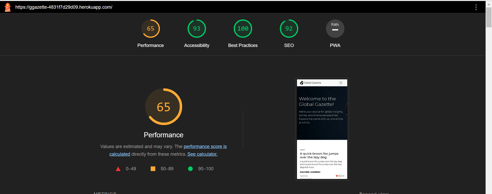

Testing
=======

Table of Contents
-----------------

*   User Story Testing
*   Manual Testing of Features
*   Validation
*   Performance

User Story Testing
------------------

In the development of the "Global Gazette" project, we thoroughly tested our user stories to ensure that the website meets the needs and expectations of our users. Each user story was tested against its acceptance criteria to ensure that the features and functionalities were working as intended.

<table>
  <tr>
    <th>User Story</th>
    <th>Acceptance Criteria</th>
    <th>Associated Feature</th>
    <th>Test Result</th>
  </tr>

  <tr>
    <td>As a user, I want to create and manage my profile to personalize my experience.</td>
    <td>Users can create their profile upon registration. Profiles are editable, allowing users to update their information, including profile pictures and bios. The follower and following counts adjust dynamically.</td>
    <td>Profile Creation, Profile Management</td>
    <td>&#9989;</td>
  </tr>

  <tr>
    <td>As a user, I want to follow/unfollow other users to customize my content feed.</td>
    <td>Users can follow or unfollow other users. This action updates their following list and the follower count of the affected profiles.</td>
    <td>Follow/Unfollow Feature</td>
    <td>&#9989;</td>
  </tr>

  <tr>
    <td>As a user, I want to create articles to share my thoughts and experiences.</td>
    <td>Users can create articles, including text and images. These articles are then visible to other users on the platform.</td>
    <td>Article Creation</td>
    <td>&#9989;</td>
  </tr>

  <tr>
    <td>As a user, I want to comment on articles to engage with other users' content.</td>
    <td>Users can add comments to articles. These comments are visible to all users who view the article.</td>
    <td>Commenting System</td>
    <td>&#9989;</td>
  </tr>

  <tr>
    <td>As a user, I want to like articles to express my appreciation for the content.</td>
    <td>Users can like articles. A count of likes is visible on each article.</td>
    <td>Like System for Articles</td>
    <td>&#9989;</td>
  </tr>

  <tr>
    <td>As a user, I want to like comments to engage with other users' interactions.</td>
    <td>Users can like comments on articles. This allows them to interact more deeply with the community.</td>
    <td>Like System for Comments</td>
    <td>&#9989;</td>
  </tr>

  <tr>
    <td>As a user, I want to securely log in and out of my account to protect my personal information.</td>
    <td>Users can log in and out of their accounts securely. Authentication is required for access to certain features.</td>
    <td>Authentication System</td>
    <td>&#9989;</td>
  </tr>

  <tr>
    <td>As a user, I want to edit my articles to correct or update the content.</td>
    <td>Users can edit the articles they have posted. Changes are saved and immediately visible to other users.</td>
    <td>Article Editing</td>
    <td>&#9989;</td>
  </tr>

  <tr>
    <td>As a user, I want to delete my articles to remove content I no longer wish to share.</td>
    <td>Users can delete their articles. Once deleted, the articles are no longer visible on the platform.</td>
    <td>Article Deletion</td>
    <td>&#9989;</td>
  </tr>

  <tr>
    <td>As a user, I want to view a feed of articles from users I follow to stay updated with content that interests me.</td>
    <td>Users can view a feed of articles posted by users they follow, providing them with a personalized content experience.</td>
    <td>Personalized Article Feed</td>
    <td>&#9989;</td>
  </tr>
<tr>
  <td>As a user, I want to edit my comments to update or correct them.</td>
  <td>Users can edit their own comments on articles, allowing them to make updates or corrections as needed.</td>
  <td>Comment Editing Feature</td>
  <td>&#9989;</td>
</tr>

<tr>
  <td>As a user, I want to delete my comments to remove my remarks when necessary.</td>
  <td>Users can delete their comments on articles, providing control over their contributions to discussions.</td>
  <td>Comment Deletion Functionality</td>
  <td>&#9989;</td>
</tr>

<tr>
  <td>As a user, I want to view other users' profiles to learn more about them and their content.</td>
  <td>Users can view the profiles of other users, including their posts, follower count, and profile information.</td>
  <td>Profile Viewing Capability</td>
  <td>&#9989;</td>
</tr>
<tr>
  <td>As a user, I want to search for specific articles or users to quickly find what I'm interested in.</td>
  <td>Users can use a search feature to find specific articles or users based on keywords or usernames.</td>
  <td>Search Functionality</td>
  <td>&#9989;</td>
</tr>

<tr>
  <td>As a user, I want to filter articles by categories or tags to find content that aligns with my interests.</td>
  <td>Users can filter articles based on categories or tags, helping them to discover content tailored to their preferences.</td>
  <td>Article Filtering System</td>
  <td>&#9989;</td>
</tr>

<tr>
  <td>As a user, I want to reset my password if I forget it to regain access to my account.</td>
  <td>Users can reset their passwords through a secure process, ensuring they can regain access to their accounts if necessary.</td>
  <td>Password Reset Feature</td>
  <td>&#9989;</td>
</tr>

<tr>
  <td>As a user, I want to see real-time updates on the platform to engage with the most current content.</td>
  <td>The platform provides real-time updates for activities like new posts or comments, keeping users engaged with the latest content.</td>
  <td>Real-Time Update Feature</td>
  <td>&#9989;</td>
</tr>
<tr>
    <td>Easily understand the purpose and main features of the website.</td>
    <td>Given that a new user visits the site, when they are on the landing page, then they should see what the purpose of the site is at the first glance.</td>
    <td>Landing page</td>
    <td>✅</td>
  </tr>
  <tr>
    <td>Easily find the 'About' link to learn about the website as a new user.</td>
    <td>Given that a user visits the site, when they are on the landing page, then they can see an about link on the landing page.</td>
    <td>About link in navbar and landing page</td>
    <td>✅</td>
  </tr>
  <tr>
    <td>See well-written instructions on how to get started.</td>
    <td>Given that a new user visits the site, when they are on the landing page, then they can see the Sign In / Sign Up buttons.</td>
    <td>About page and landing page buttons</td>
    <td>✅</td>
  </tr>
  <tr>
    <td>See sign-up and sign-in links to access the website's functionality.</td>
    <td>Given that a new user visits the site, when they are on the landing page, then they can see the Sign In / Sign Up links in the navbar.</td>
    <td>Navigation links for Sign In/Sign Up</td>
    <td>✅</td>
  </tr>
  <tr>
    <td>Easily sign out for enhanced account security.</td>
    <td>Given that a new user is on any page, when they are logged in, then they can see the Sign out link in the navbar.</td>
    <td>Sign-out link in navbar</td>
    <td>✅</td>
  </tr>
  <tr>
    <td>Maintain logged-in status for consistent user experience.</td>
    <td>Given that a new user is signed in, when they don't even visit the website, then they still remain signed in for 24 hours.</td>
    <td>Access token mechanism</td>
    <td>✅</td>
  </tr>
  <tr>
    <td>View a navigation bar on every page.</td>
    <td>Given that new/returning user visits the site, when they are on any web page, then they can see navigation items on the screen clearly labeled with their function.</td>
    <td>Navigation bar features</td>
    <td>✅</td>
  </tr>

</table>

Manual Testing of Features
--------------------------

I meticulously tested all aspects of the website, ensuring that every feature worked seamlessly across various browsers and devices. My approach was thorough, aligning closely with the original user stories and their respective acceptance criteria.

### Key Testing Areas

*   **CRUD Operations:** I rigorously tested Create, Read, Update, and Delete (CRUD) functionalities for Posts, Comments, Likes, Follows, and Profiles. This was done in both the development environment and the deployed version of the site to ensure consistency and reliability.
*   **Navigation:** I verified that all navigation links are functioning correctly, leading to the appropriate pages without errors.
*   **Responsive Design:** The website’s responsiveness was checked across a range of device sizes to guarantee a fluid and adaptable user experience.
*   **Authentication:** Authentication processes were thoroughly tested. This included checking different navigation and access options for logged-in versus logged-out users to ensure proper access controls are in place.
*   **Error Handling:** I entered non-existent URLs to confirm that the 'Not Found' pages display correctly, thereby enhancing the user experience even when encountering errors.

<h4>Landing Page</h4>
<table>
  <tr>
    <th>Expected Feature</th>
    <th>Result</th>
  </tr>
  <tr>
    <td>Sign Up link leads to the registration page</td>
    <td>Pass</td>
  </tr>
  <tr>
    <td>Sign In link opens the login form</td>
    <td>Pass</td>
  </tr>
  <tr>
    <td>Landing page effectively displays the purpose of the site</td>
    <td>Pass</td>
  </tr>
  <tr>
    <td>Navigation to 'About' page from the landing page</td>
    <td>Pass</td>
  </tr>
  <tr>
    <td>Visibility and accessibility of the main features</td>
    <td>Pass</td>
  </tr>
</table>

<h4>Profile Management</h4>
<table>
  <tr>
    <th>Expected Feature</th>
    <th>Result</th>
  </tr>
  <tr>
    <td>Creation and viewing of user profiles</td>
    <td>Pass</td>
  </tr>
  <tr>
    <td>Editing and updating of user profile</td>
    <td>Pass</td>
  </tr>
  <tr>
    <td>Follow and unfollow functionality</td>
    <td>Pass</td>
  </tr>
  <tr>
    <td>Display of follower and following count</td>
    <td>Pass</td>
  </tr>
</table>

<h4>Article Interaction</h4>
<table>
  <tr>
    <th>Expected Feature</th>
    <th>Result</th>
  </tr>
  <tr>
    <td>Ability to create, view, edit, and delete articles</td>
    <td>Pass</td>
  </tr>
  <tr>
    <td>Liking and unliking articles</td>
    <td>Pass</td>
  </tr>
  <tr>
    <td>Comments functionality on articles</td>
    <td>Pass</td>
  </tr>
  <tr>
    <td>Searching and filtering articles</td>
    <td>Pass</td>
  </tr>
</table>

<h4>Comments and Reactions</h4>
<table>
  <tr>
    <th>Expected Feature</th>
    <th>Result</th>
  </tr>
  <tr>
    <td>Posting and viewing comments</td>
    <td>Pass</td>
  </tr>
  <tr>
    <td>Editing and deleting own comments</td>
    <td>Pass</td>
  </tr>
  <tr>
    <td>Liking and unliking comments</td>
    <td>Pass</td>
  </tr>
</table>

<h4>Authentication and Security</h4>
<table>
  <tr>
    <th>Expected Feature</th>
    <th>Result</th>
  </tr>
  <tr>
    <td>User registration and login</td>
    <td>Pass</td>
  </tr>
  <tr>
    <td>User logout functionality</td>
    <td>Pass</td>
  </tr>
  <tr>
    <td>Access control based on authentication</td>
    <td>Pass</td>
  </tr>
  <tr>
    <td>Session management and security</td>
    <td>Pass</td>
  </tr>
</table>
<h4>Search Feature</h4>
<table>
  <tr>
    <th>Expected Feature</th>
    <th>Result</th>
  </tr>
  <tr>
    <td>Allows to search through author name, post title, and category</td>
    <td>Pass</td>
  </tr>
  <tr>
    <td>Search feature accessible on all list pages</td>
    <td>Pass</td>
  </tr>
</table>

<h4>Popular Profiles</h4>
<table>
  <tr>
    <th>Expected Feature</th>
    <th>Result</th>
  </tr>
  <tr>
    <td>Displays top followed profiles on large devices</td>
    <td>Pass</td>
  </tr>
  <tr>
    <td>Shows first four popular profiles on smaller devices</td>
    <td>Pass</td>
  </tr>
  <tr>
    <td>Visible on all list and detail pages</td>
    <td>Pass</td>
  </tr>
  <tr>
    <td>User avatars, names, and follow buttons featured</td>
    <td>Pass</td>
  </tr>
  <tr>
    <td>Ability to follow/unfollow from the popular profiles list</td>
    <td>Pass</td>
  </tr>
</table>

<h4>Post Section in PostsListPage (Home)</h4>
<table>
  <tr>
    <th>Expected Feature</th>
    <th>Result</th>
  </tr>
  <tr>
    <td>Posts displayed as cards with infinite scroll</td>
    <td>Pass</td>
  </tr>
  <tr>
    <td>Each post includes title, category, description, and image</td>
    <td>Pass</td>
  </tr>
  <tr>
    <td>Like and Comment icons with counters</td>
    <td>Pass</td>
  </tr>
  <tr>
    <td>Ability to like posts and view comments</td>
    <td>Pass</td>
  </tr>
  <tr>
    <td>Responsive design for post section</td>
    <td>Pass</td>
  </tr>
</table>

<h4>Comments</h4>
<table>
  <tr>
    <th>Expected Feature</th>
    <th>Result</th>
  </tr>
  <tr>
    <td>Comment section accessible under posts in detail pages</td>
    <td>Pass</td>
  </tr>
  <tr>
    <td>Comment addition, editing, and deletion for post owners</td>
    <td>Pass</td>
  </tr>
  <tr>
    <td>Comment date displayed; editing of others' comments restricted</td>
    <td>Pass</td>
  </tr>
</table>

<h4>Like/Unlike Feature</h4>
<table>
  <tr>
    <th>Expected Feature</th>
    <th>Result</th>
  </tr>
  <tr>
    <td>Users can like/unlike posts and comments</td>
    <td>Pass</td>
  </tr>
  <tr>
    <td>Liked posts appear in a dedicated 'Liked' page</td>
    <td>Pass</td>
  </tr>
  <tr>
    <td>Like counters visible on all pages</td>
    <td>Pass</td>
  </tr>
</table>

<h4>Post Detail Page</h4>
<table>
  <tr>
    <th>Expected Feature</th>
    <th>Result</th>
  </tr>
  <tr>
    <td>Detailed post information with like and comment options</td>
    <td>Pass</td>
  </tr>
  <tr>
    <td>Edit and delete options for post owners</td>
    <td>Pass</td>
  </tr>
</table>

<h4>Post Edit Form</h4>
<table>
  <tr>
    <th>Expected Feature</th>
    <th>Result</th>
  </tr>
  <tr>
    <td>Accessible post edit form for post owners</td>
    <td>Pass</td>
  </tr>
  <tr>
    <td>Editable fields for title, category, description, and image</td>
    <td>Pass</td>
  </tr>
</table>

<h4>Profile Details Page</h4>
<table>
  <tr>
    <th>Expected Feature</th>
    <th>Result</th>
  </tr>
  <tr>
    <td>Accessible profiles with follow counts and posts</td>
    <td>Pass</td>
  </tr>
  <tr>
    <td>Edit options for profile owners</td>
    <td>Pass</td>
  </tr>
</table>

Validation and Performance
--------------------------

### HTML Validation

The website's HTML was validated using the [W3C Markup Validation Service](https://validator.w3.org/). The validation process confirmed that the HTML structure is error-free and adheres to current web standards.

### CSS Validation

The CSS of the website was validated through the [W3C CSS Validator (Jigsaw)](https://jigsaw.w3.org/css-validator/validator). The validation process confirmed that the CSS code complies with the latest CSS specifications without any issues.

### JSX Validation with ESLint

ESLint was utilized for JSX validation, Some initial errors were encountered and resolved as follows:

*   Error with Infinite Scroll component's children prop: Resolved by restructuring the component's code.
*   Display name error in DropdownMenu.js: Resolved by disabling the specific ESLint rule "react/display-name" in the .eslintrc.json file, as per guidance from [Quora](https://www.quora.com/Why-is-component-definition-missing-display-name-react-display-name-error-occur-JavaScript-HTML-arrays-reactjs-antd-development).

### Performance Testing

Performance testing was conducted using the Lighthouse tool in the Chrome DevTools. The tests were carried out for both desktop and mobile versions of the website to ensure optimal performance across different devices.

Mobile Performance Results:

